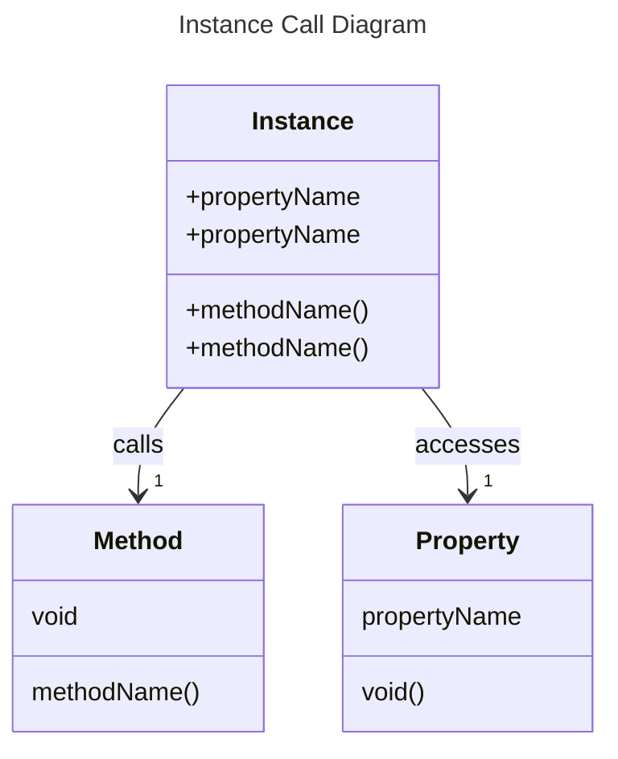
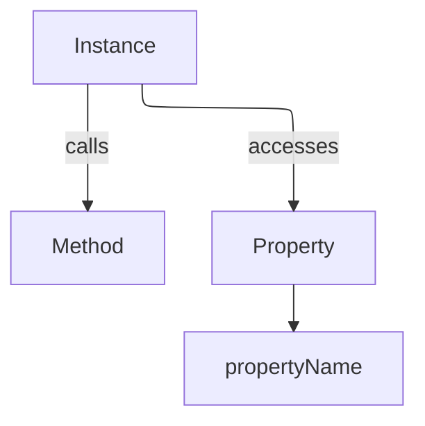

# Concepts

## Instances

### Classes and Objects

In Cosmolang Core, a class is defined using the `class` keyword followed by the class name and a block of code that defines its properties and methods. An object is an instance of a class, created using the `new` keyword.

```cosmolang
new class MyClass;
```

### Calls of Instances
Instances can be called using the `::` syntax, which allows for method invocation and property access.

```cosmolang
instance::methodName();
```
or
```cosmolang
instance::propertyName;
```





## Hotloader


# Sequential Execution

1. Sequential execution of a function (default behavior).
2. Sequential execution of raw code (e.g. labels one after another. Also, comparable to python noob code if you don't use functions).
