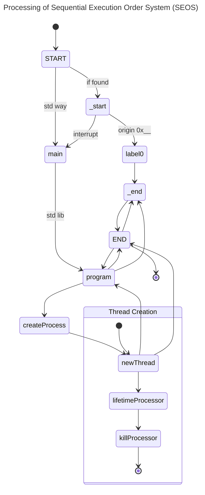
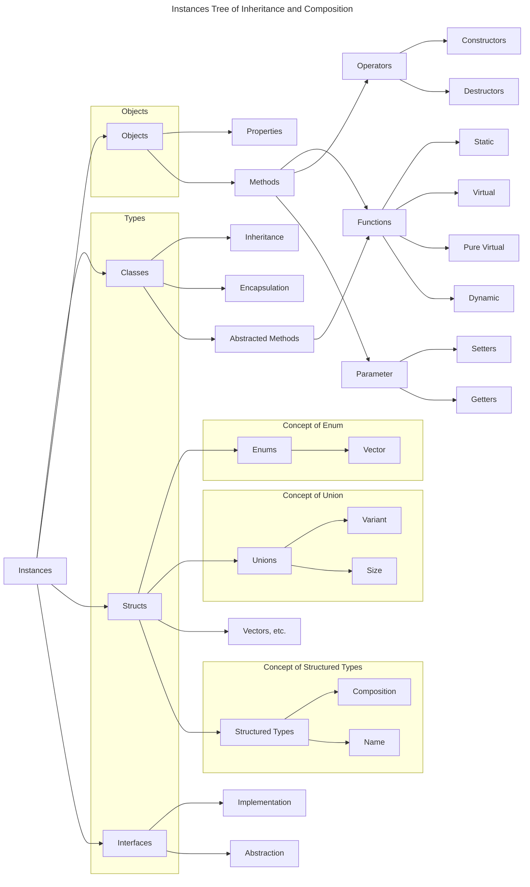

# Keywords

## How we document the examples

- `<types>`: Placeholder for one or more data types (e.g., `int`, `float`, `string`, etc.). It is optional to specify types. Use `void` if no type is needed and `auto` for safe return.
- `types`: Placeholder for one or more data types (e.g., `int`, `float`, `string`, etc.). It is mandatory to specify types.

In examples there is sometimes a number in the first order of the line. It indicates the order of phrasing. The next number after the dot represents the executional order.

# Basic for running sections

## `function`

A function is defined by the `function` keyword, followed by the function name, parameters in parentheses, and a block of code enclosed in curly braces. Functions can return values using the `return` statement.

```cosmolang
function <types> functionName(param1, param2) {
    return result;
}<;>
```

> [!Note]
> The semicolon (`;`) at the end of the function definition is optional.

## `return`

The `return` keyword is used to exit a function and optionally return a value to the caller.

For safe code, use `auto` as the return type to ensure that the function always returns a value of the correct type.

```cosmolang
function <types> functionName(param1, param2) {
    return result; // Returns a value of the specified type
}<;>
function auto safeFunction() {
    return defaultValue; // Always returns a value of the correct type
}<;>
```

For `void` use `return;` without a value.

```cosmolang
function void voidFunction() {
    return; // Exits the function without returning a value
}<;>
```

You don't have to use `return` in a `void` function, but you can if you want to exit early.

> [!Note]
> If you don't do it, the compiler will do it for you.

## `label:`
A label is defined by a name followed by a colon (`:`). It is used as a target for the `goto` statement.

```cosmolang
labelName:
    // Code to execute when jumped to this label
```

Also, possible is

```cosmolang
labelName: statement; // A single statement can follow the label
label: name;
    // Code to execute when jumped to this label
```

But what is not possible is chained labels:

```cosmolang
label1: label2: // This is not allowed
    // Code to execute when jumped to label1 or label2
```

> [!IMPORTANT]
> Labels must be unique within the same function scope.
>
> If you have multiple labels one after another, they will be executed in sequence when jumped to the first label.
> If you don't want that, you need to jump back to the function sequentially execution.

> [!Note]
> There are two sequential execution types:
> 1. Sequential execution of a function (default behavior). Asynchrony can be guaranteed here.
> 2. Sequential execution of raw code (e.g. labels one after another. Also, comparable to python noob code if you don't use functions). Asynchrony can be guaranteed here, but through other means like starting an asynchronous function that calls different function with gotos. Small rule of thumb: Don't use it unless you use ancient and low code.
>
> I don't like `async goto label;`. It looks weird. If you want asynchrony, use functions. Probably it will be added.

### `start:`, `_start:`, `end:`, `_end:` etc.

These are special labels that can be used to denote the beginning and end of a function or code block. It is especially used for the program endings and beginnings. They can be used for clarity and organization.

```cosmolang
1.2 end:
    // Code to execute at the end
2.1 start:
    // Code to execute at the start
```

## `goto` vs `function(...)`

The `goto` keyword is used for unconditional jumps to a labeled statement within the same function, while `function(...)` is used to call another function and can pass parameters and receive return values.

```cosmolang
goto labelName; // Jumps to the label within the same function
functionName(param1, param2); // Calls another function
```

## Examples with all
```cosmolang
1.- function void exampleFunction() {};

2.- label1:
3.- label2:
    // Code to execute when jumped to label1 it goes to label2

4.1 label: start;
5.-    // Code to execute
6.2    exampleFunction(); // Calls the exampleFunction
7.3    goto start; // Jumps to the start label

```

### Processing of Sequential Execution Order System (SEOS)



# Instances



Vectors are the standard array type in Cosmolang Core. They can hold multiple values of the same type and provide various methods for manipulation.

## Variables

## Symbols / Macros

## Constants

## Inheritance

Through the inheritanging of instances it is possible to copy or move data of a scope to another scope without the need of copying or moving it manually.

It also allows a dynamic lifetime management of data and objects. Through new instances the heritage tree will grow and through the deletion of instances it will shrink.

## Changeability and Mutability

## Visibility

## Classes and Objects